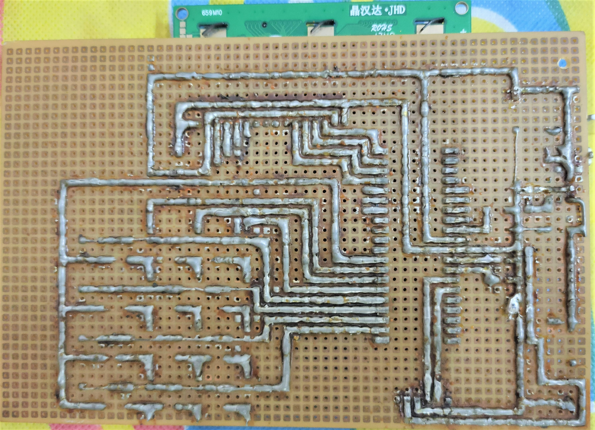
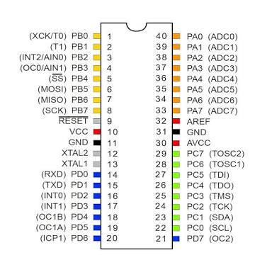
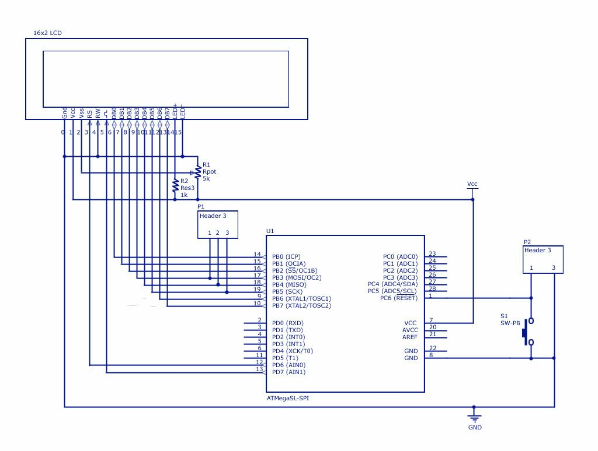

# Pager

Fabricated end-to-end communication device which allows a user to communicate with android phone over
"Bluetooth". Micro-controller is programmed using C++ language, and the algorithm could detect the 
key press and convert into a character, consequently append to main "String" and further transmit over
Bluetooth channel.

<h6>This project could be implemented using Arduino and logic for key-press and its detection would remain same</h6>

  
  

 <kbd></kbd>
 

   
  

    
 

 <kbd></kbd>
 

    
  

   
 

 <kbd></kbd>
 <kbd></kbd>

 

# Technical Stack
* language - Cpp
* software - CVAVR & Proteus7 

# Main Compnents Used
* Alphanumeric LCD,
* Micro-controller IC (Atmega 16),
* USB ASP driver
